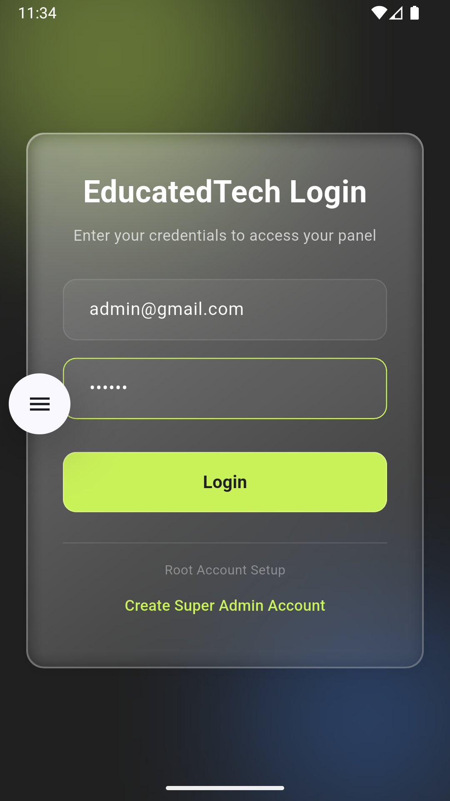
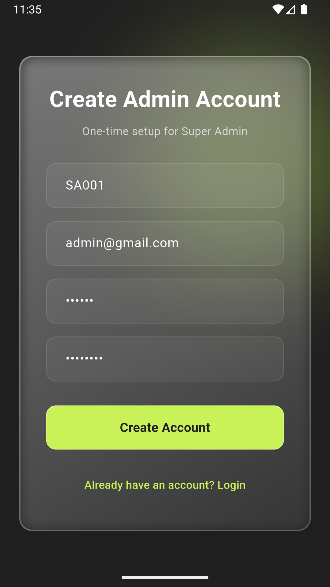

# EduConnect


EduConnect is a professional-grade school management system built with Flutter and Firebase, designed to streamline academic operations through a high-performance, role-based architecture. It provides a unified platform for Super Admins, School Admins, Teachers, Students, and Parents to manage education in real-time.

---

## 🚀 Key Features

*   **Role-Based Dashboards**: Tailored experiences for 5 distinct user roles with secure navigation.
*   **Academic Excellence Hub**: Real-time result processing, automated marks matrices, and class ranking.
*   **Security & Access Control**: Immediate student login suspension via Admin toggle and strict role validation.
*   **Public Ranking System**: A "Wall of Fame" for elite institutions based on verified performance metrics.
*   **Modern Aesthetics**: Premium dark-mode UI with glassmorphism effects and responsive layouts.
*   **Real-time Synchronization**: Powered by Cloud Firestore for instant updates across the ecosystem.

---

## 🛠 Recently Implemented (Client Requirements)

The following high-priority features were recently integrated and verified:

*   **Student Login Access Control**: Admins can now toggle a student's login permission. Disabled accounts are automatically logged out and hidden from teacher interfaces.
*   **Advanced Result Module**: Implementation of a sophisticated marks entry matrix for teachers and a detailed result summary for students.
*   **Intelligent Ranking Algorithm**: A custom-weighted ranking logic (Marks 50%, Faculty 30%, Attendance 20%) that excludes inactive students.
*   **Super Admin Singleton Guard**: Hardened registration flow ensuring only one Super Admin account exists globally.

---

## 👥 User Roles

| Role | Responsibility |
| :--- | :--- |
| **Super Admin** | Platform-wide oversight, school registration, and system audit logs. |
| **School Admin** | Student/Teacher enrollment, fee management, and exam scheduling. |
| **Teacher** | Attendance tracking, result matrix entry, and student analytics. |
| **Student** | Personal result history, exam schedules, and performance tracking. |
| **Parent** | Multi-student monitoring, fee status, and school announcements. |

---

## 🏗 Project Structure

```text
lib/
├── main.dart                 # App entry point & service initialization
├── firebase_options.dart      # Generated Firebase configuration
└── app/
    ├── core/                 # Shared utilities, widgets, and constants
    ├── data/                 # Models, Enums, and common providers
    ├── modules/              # GetX feature modules (Views, Controllers, Bindings)
    │   ├── auth/             # Login, Signup, and Splash logic
    │   ├── school_admin/     # Comprehensive campus management
    │   ├── teacher/          # Academic and classroom tools
    │   ├── student/          # Learner dashboard and results
    │   └── public/           # Landing page and ranking views
    ├── routes/               # App routing and role-based redirect logic
    └── services/             # Core business logic (Auth, Data, Ranking)
```

---

## 📸 Screenshots

### Splash Screen


### Landing Page & Public Ranking


### Authentication Flow
| Login Screen | Super Admin Signup |
| :---: | :---: |
|  |  |


---

## ⚙️ Setup & Installation

### Prerequisites
*   Flutter SDK (Stable channel)
*   Android Studio / VS Code
*   A Firebase Project

### Installation Steps

1.  **Clone the Repository**
    ```bash
    git clone https://github.com/Hamzasher02/EDUConnect.git
    cd EDUConnect
    ```

2.  **Install Dependencies**
    ```bash
    flutter pub get
    ```

3.  **Firebase Configuration**
    *   Place your `google-services.json` in `android/app/`.
    *   Add your SHA-1 and SHA-256 fingerprints in the Firebase Console to enable Google services.
    *   Enable **Email/Password** Authentication and **Cloud Firestore** in your Firebase project.

4.  **Run the App**
    ```bash
    flutter run -d <your-device-id>
    ```

---

## 🛡 Security & Testing

*   **Logic Verification**: All authentication guards and ranking calculations have been manually verified on Android emulators.
*   **Linter Compliance**: Project passes `flutter analyze` with high standards for code quality.
*   **Environment**: Configured for `com.example.edutech` package identity with isolated Firestore collections.

---

## 💡 Future Roadmap

*   [ ] Hardened Firestore Security Rules for production.
*   [ ] Multi-campus support for larger institutional chains.
*   [ ] Integrated PDF report generation for fee slips and results.
*   [ ] Push notification system for real-time alerts.

---

**Developed & Maintained by Hamza Sher**
